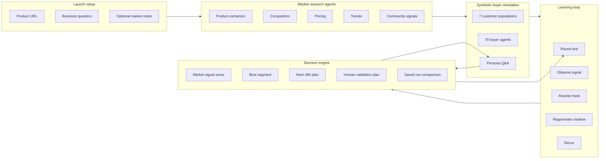

# Crucible

> Synthetic market pre-research for product launches.

Paste a product URL, generate seven source-backed customer populations, run message-testing rounds, ask individual synthetic buyers follow-up questions, and leave with a concrete validation plan.

Crucible is intentionally framed as pre-research:

> Synthetic research is not proof. It helps you choose what to validate next.

## What It Does

1. Reads a product URL and optional market context.
2. Uses live web research to collect product, competitor, pricing, trend, and community signals.
3. Generates seven customer populations and 70 synthetic buyers.
4. Tests launch messages across repeatable rounds.
5. Rewrites weak hooks and regenerates creatives when configured.
6. Produces a final launch action plan:
   - who to target first
   - why that segment showed the strongest signal
   - what message to test
   - what objection to handle
   - where to find buyers
   - what campaign to launch next
   - what to validate with real humans

The app avoids presenting synthetic reactions as real conversion. The UI uses market signal score, message-market fit, objection intensity, signal strength, and confidence level.

## Architecture



## Stack

- Next.js 14 App Router
- TypeScript
- Tailwind CSS
- Framer Motion
- Three.js
- OpenAI for product synthesis, populations, reactions, hooks, and persona chat
- Tavily for market research
- FAL for optional image/video generation
- Gradium or OpenAI TTS for optional buyer voice

## Run Locally

```bash
npm install
npm run dev
```

Open <http://localhost:3000>.

Create `.env.local`:

```bash
OPENAI_API_KEY=...
OPENAI_MODEL=gpt-4o-mini
TAVILY_API_KEY=...

# Optional
FAL_KEY=...
GRADIUM_API_KEY=...
```

OpenAI is required for the core simulation. Tavily is recommended because the final report is much stronger when populations are anchored in real market sources. FAL and Gradium are optional product-experience layers.

## API Routes

| Route | Purpose |
| --- | --- |
| `/api/run` | SSE stream for market research, product brief, populations, buyers, and initial assets |
| `/api/round` | Runs one message-testing round and returns buyer states plus tribe scores |
| `/api/finalize` | Builds the per-population playbook |
| `/api/ask-buyer` | Answers a founder question in one buyer persona |
| `/api/generate-creative` | Optional FAL image generation |
| `/api/regenerate-creative` | Optional hook rewrite plus image regeneration |
| `/api/generate-video` | Optional FAL video job |
| `/api/video-status` | Optional FAL video polling |

## Product Principles

- Be transparent: synthetic buyers are directional, not proof.
- Make the report the product: every run should end with a concrete next action.
- Prefer decisions over dashboards: target, retest, or avoid each population.
- Anchor personas in sources: product page, competitors, pricing, trends, and community signals.
- Keep humans in the loop: the final output includes discovery questions, outbound copy, landing page angles, ad tests, and go/no-go criteria.
- Save and compare runs locally so founders can compare URL, message, segment, and round outcomes.

## File Map

```text
app/
  page.tsx                       # main UI orchestration
  api/
    run/route.ts                  # SSE research + populations
    round/route.ts                # synthetic round simulation
    finalize/route.ts             # per-population playbook
    ask-buyer/route.ts            # persona chat + optional voice
components/
  LaunchSetup.tsx                 # product URL entry
  TribeColumn.tsx / TribeCard.tsx # source-backed populations
  MarketWorld3D.tsx               # animated buyer world
  FinalReport.tsx                 # final action plan
  RecommendationFourBlocks.tsx    # target, hook, objection, validation
  TribePlaybook.tsx               # per-population targeting plan
lib/
  session.ts                      # client state machine
  market-score.ts                 # market signal scoring helpers
  agents.ts                       # generated buyer coordinates/personas
  integrations/                   # OpenAI, Tavily, FAL, Gradium
```

## Deployment Notes

This repository exposes API routes that can spend third-party API credits. Before deploying publicly, add authentication, rate limiting, and per-user quotas.

## License

MIT
