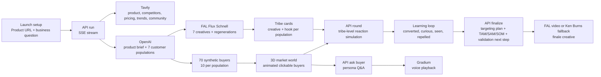

# Crucible

> **Pre-research for product launches.** Paste a B2B URL, get 70 synthetic buyers reacting across 7 customer populations, talk to any buyer by voice, and leave with a targeting plan in two minutes.

Built for the **Tech: Europe Paris AI Hackathon** (May 16, 2026).

Crucible focuses on the step before real interviews: **narrow the market first, then validate with humans**.

---

## What it does

1. You paste a product URL. The default demo path uses `https://fal.ai`.
2. **Tavily** orchestrates live market intelligence — product page extraction, competitors, pricing, trends, and community signals — and streams results into a visible orchestrator panel.
3. **OpenAI** generates 7 customer tribes adapted to your test type (10 buyers each = 70 simulated buyers).
4. **FAL Flux Schnell** generates 7 ad creatives in parallel, one per tribe, painted onto each TribeCard as they arrive.
5. The agent runs unlimited learning rounds. The demo shows three:
   - **Round 1**: broad exploration.
   - **Round 2**: weak hooks are rewritten and poor creatives regenerate in place.
   - **Round 3**: the strongest segment is sharpened into a launch recommendation.
6. The final report gives a global recommendation plus a per-population playbook: who to target, why they reacted, what to change, how to reach them, and who to validate with real humans.
7. **Click any of the 70 buyers** in the 3D market or playbook and ask them questions. They answer in persona (OpenAI) and voice playback is powered by **Gradium**.

## Why this matters

Most founders can describe their TAM, but still do not know who to message on Monday morning. Real customer research is essential, but recruiting the wrong people is expensive and slow.

Crucible is the cheap, fast pre-research layer:

- **TAM**: all possible buyers in the category.
- **SAM**: populations matching the product promise.
- **SOM**: the first reachable population to target and validate now.

> One product in. Seven populations. Seventy buyers. One launch decision.

Crucible does **not** claim synthetic buyers are final truth. It reduces the search space and tells founders who to validate next with real interviews.

## Final demo path

Use `https://fal.ai`.

```text
What are you launching?
Fast image and video generation API for AI product teams.

Target market
B2B AI app builders, creative automation tools, agencies, and growth teams.
```

Talk track:

> "For the demo, I am testing fal.ai, one of the sponsors. The business question is simple: among B2B buyers, who should fal target first, and what message makes them convert?"

## Architecture



## Stack

- **Next.js 14** (App Router) + **TypeScript** + **Tailwind CSS** + **Framer Motion**
- Single Next.js app, no separate backend, no database.
- In-memory state during the session; deterministic fallback session under `lib/demo/` for demo reliability.

### Sponsor integrations

| Partner   | What it powers                                                | Live or fallback                                      |
| --------- | ------------------------------------------------------------- | ----------------------------------------------------- |
| OpenAI    | Product brief, 7 populations, tribe-level reaction simulation, hook rewrites, buyer persona Q&A, final playbook | Live with `OPENAI_API_KEY`; falls back to deterministic demo logic |
| Tavily    | Multi-step orchestrator — product page extract, competitors, pricing, trends, community signals, streamed via SSE | Live with `TAVILY_API_KEY`; falls back to demo signals |
| FAL       | Flux Schnell × 7 ad-creative images per tribe; +2 regenerated images on Round 2; Veo3 fast video at the finale (built from every learning) | Live with `FAL_KEY`; 9 pre-cached PNGs for the Oura fallback path; Ken Burns image loop if video timeouts |
| Gradium   | Voice synthesis for any of the 70 buyers, mapped to 5 voice profiles (gender × age) derived from each persona | Live with `GRADIUM_API_KEY`; 5 macOS-synthesized m4a fallbacks (one per voice profile) |

Recommendation cards display **"Synthetic confidence · ~85%"** and **"Validate with real interviews"**. This is intentionally framed as a synthetic signal, not benchmark-validated ground truth.

## Run locally

```bash
pnpm install
pnpm dev
```

Open <http://localhost:3000>.

For the recorded demo, no API keys are required — the fallback session for `https://ouraring.com` is deterministic and runs purely from `lib/demo/`. Set `CRUCIBLE_DEMO_MODE=1` to force fallback even with live keys.

### Optional: live mode

Create a `.env.local` with any of:

```bash
OPENAI_API_KEY=...
OPENAI_MODEL=gpt-4o-mini
TAVILY_API_KEY=...
FAL_KEY=...
GRADIUM_API_KEY=...
GRADIUM_VOICE_ID=claire-eu
```

Live mode kicks in when the product URL is not Oura. If an asset-generation call fails, Crucible now creates product-specific fallback hooks instead of leaking the Oura demo copy into live reports. Every sponsor call is wrapped in try/catch and degrades without blocking the core demo.

## API surface

All routes are POST and return JSON.

| Route               | Body                                                                                 | Notes                                                               |
| ------------------- | ------------------------------------------------------------------------------------ | ------------------------------------------------------------------- |
| `/api/run`          | `{ productUrl, platform, testType, productNote, targetMarket, assetMode }`          | SSE stream: market signals, brief, tribes, initialAssets, agents    |
| `/api/round`        | `{ round, brief, tribes, assets, previousRounds }`                                  | Returns roundResult, updatedAssets, updatedAgents                   |
| `/api/ask-buyer`    | `{ buyer, tribe, question }`                                                        | Returns text answer (OpenAI) + audioUrl (Gradium for hero buyer)    |
| `/api/finalize`     | `{ brief, rounds, tribes, assets }`                                                 | Returns per-population targeting playbook                           |
| `/api/generate-creative` | `{ productName, tribeName, hook, assetMode }`                                  | Returns FAL image URL                                               |
| `/api/regenerate-creative` | `{ productName, tribe, previousHook, failureReason }`                         | Returns rewritten hook + regenerated FAL image                      |
| `/api/generate-video` | `{ productName, winningHook, winningTribeName, ... }`                             | Starts FAL video job                                                |
| `/api/video-status` | `{ id }` via query string                                                           | Polls FAL video status                                              |

## URL shortcuts for the demo

For convenience while recording or rehearsing:

- `?stage=tribes` — skip to tribes generated state
- `?stage=r1` — jump to round 1 results
- `?stage=r2` — jump to round 2 results
- `?stage=r3` — jump to round 3 results
- `?stage=winner` — jump to final recommendation
- `?stage=winner&select=tribe_2_a1` — open hero buyer drawer

## File map

```text
app/
  layout.tsx
  page.tsx                       # orchestrator
  globals.css
  api/
    run/route.ts                  # SSE market intelligence + tribes + initial assets
    round/route.ts                # round simulation + buyer states
    ask-buyer/route.ts            # persona Q&A + voice
    finalize/route.ts             # per-population targeting playbook
    generate-creative/route.ts    # FAL image generation
    regenerate-creative/route.ts  # hook rewrite + FAL image regeneration
    generate-video/route.ts       # FAL finale video
    video-status/route.ts         # FAL queue polling
components/
  LaunchSetup.tsx                 # one-question demo setup
  TopBar.tsx
  TribeCard.tsx / TribeColumn.tsx
  MarketWorld3D.tsx               # 70 animated 3D buyers + state colors
  RightPanel.tsx                  # round metrics, learning, recommendation
  RecommendationFourBlocks.tsx    # final decision + TAM/SAM/SOM + validation next step
  TribePlaybook.tsx               # per-population report
  BuyerDrawer.tsx                 # ask-a-buyer with Gradium voice
lib/
  types.ts
  session.ts                      # state machine for the UI
  fallback-assets.ts              # product-specific fallback hooks for live demos
  simulation.ts
  integrations/
    openai.ts / tavily.ts / fal.ts / gradium.ts / pioneer.ts
  demo/
    brief.ts                      # Oura fallback brief
    tribes.ts                     # 7 tribes
    agents.ts                     # 70 buyers + per-round state sequences
    assets.ts                     # 21 launch assets (3 rounds × 7 tribes)
    rounds.ts                     # round results + learnings
    recommendation.ts             # final launch decision
  demo-data.ts                    # composes everything
public/
  demo/
    buyer-voice.m4a               # cached hero buyer voice
```

## Demo design rules (followed)

- One perfect flow over many fragile ones: fal.ai as the main live demo product, Oura as deterministic fallback.
- Deterministic fallback session that runs without any keys.
- No more than 7 LLM calls per round (tribe-level reactions, not per-buyer).
- Every sponsor call wrapped in try/catch with cached fallback.
- Synthetic signal is explicitly framed as pre-research, with a real-interview validation next step.
- The final report is not just a winner card: every population gets reasons, targeting advice, changes to make, and questions to ask next.

## License

MIT for the code. The Oura Ring brand is referenced only for demo purposes.
